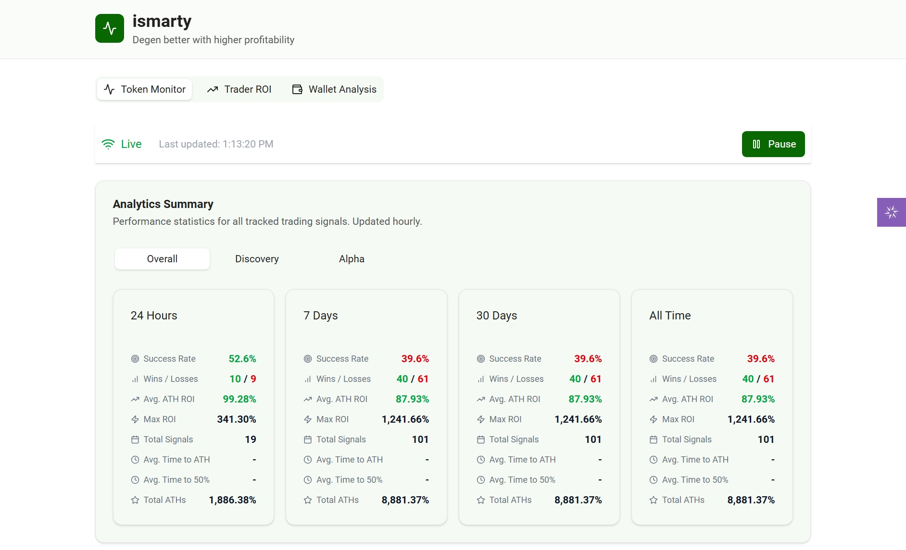
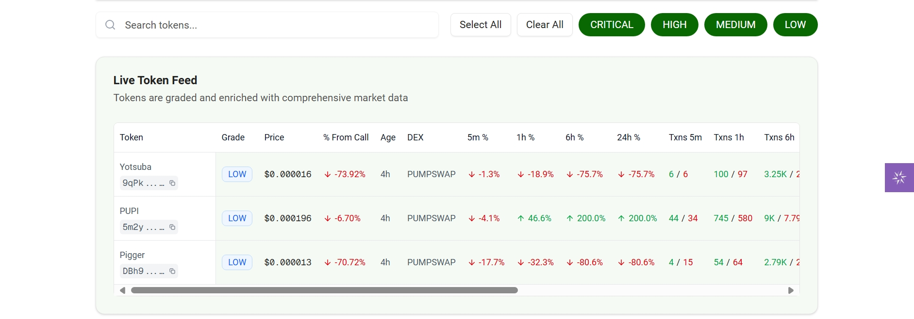
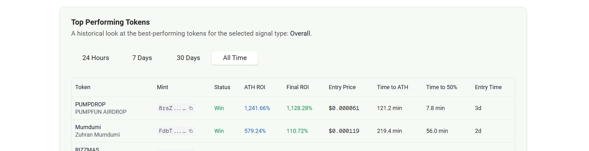
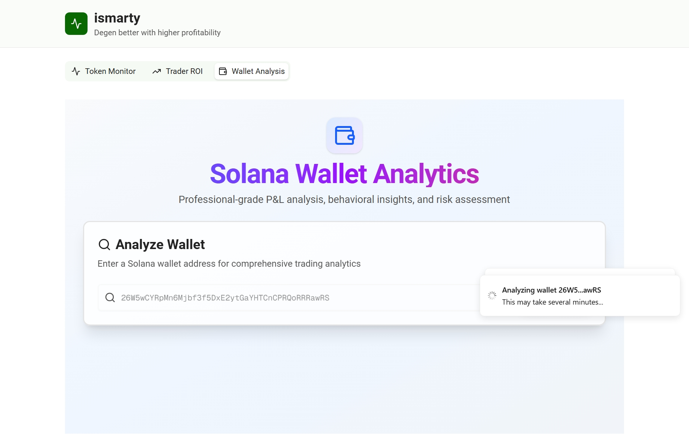
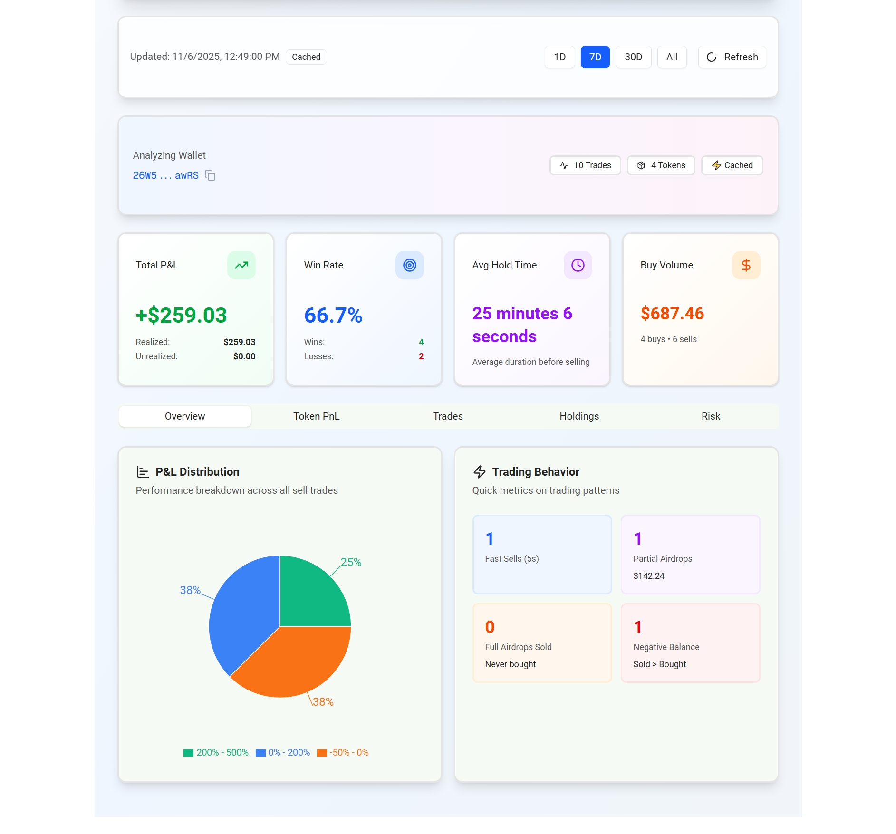
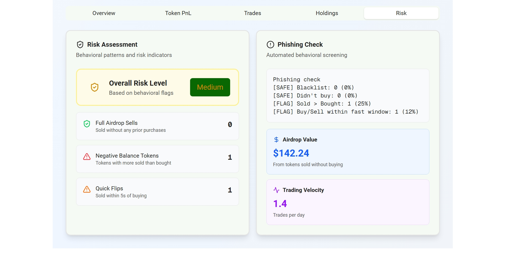

# User Guide: Web Dashboard

The web dashboard provides a powerful visual interface for analyzing signal performance, finding profitable traders, and deep-diving into wallet statistics.

## 1. Token Monitor

This is the main dashboard for understanding the historical performance of the bot's signals and viewing the live feed of signals dropped. It is powered by the `alpha leak` and `token discovery` service.

### Analytics Summary

This section shows the aggregated performance of all signals. It is powered by the `tracker` service, which tracks every signal's data from the moment of detection for any signal type independently. You can filter by signal type:

* **Overall:** The combined statistics for all signal types.
* **Discovery:** Performance of standard signals from the `token discovery` service.
* **Alpha:** Performance of high-priority signals from the `alpha leak` service.

#### Key Metrics Explained

| Metric | Description |
| :--- | :--- |
| **Success Rate** | The percentage of signals that achieved the "Win" threshold (defined as **+50% ROI** at any point). |
| **Wins / Losses** | The total count of signals that hit the "Win" threshold vs. those that completed their tracking duration (e.g., 24h for tokens less than 12hours old when signal dropped and 7Day for tokens up to 12 hours old at signal time, ) without hitting it. |
| **Avg. ATH ROI** | The average "All-Time High" (ATH) Return on Investment (ROI) reached by all signals in this category. |
| **Max ROI** | The single best ROI achieved by any signal in this category. |
| **Total Signals** | The total number of signals tracked in this category and timeframe. |
| **Avg. Time to ATH** | The average time (in minutes) it took for a signal to reach its peak price. |
| **Avg. Time to 50%** | For *winning* signals, the average time it took to hit the +50% win threshold. |

### Live Token Feed

This table shows the *current* state of tokens being monitored by the `token discovery` service. It is a live-updating feed, not a historical analysis.

### Top Performing Tokens

This section shows the best-performing tokens from the selected signal type and timeframe. This is a historical list of "greatest hits".

## 2. Trader ROI Analysis

This tool allows you to run a custom analysis to find the **most profitable traders** for a specific token (or set of tokens max of three with token age less than 2Days).

### How to Use

1.  **Enter Token Addresses:** Add 1-3 token addresses you want to analyze. The system will validate them (checking if they are < 2 days old).
2.  **Set Filters**:
    * **Trader Type:** "All" traders or "Early" traders (who bought within a specific window).
    * **Window (hrs):** If "Early" is selected, define the time window (e.g., first 6 hours).
    * **Min First Buy ($):** Ignore traders who invested less than this amount.
    * **Min Tokens in Profit:** Ignore traders who haven't traded at least this many other tokens profitably.
3.  **Run Analysis:** The system will submit a job to find and analyze all traders for that token based on your filters.
4.  **View Results:** The "Your Active Analysis Jobs" card will show the job's progress. Once complete, you can select the analysis from the dropdown to view the results.

The output is a ranked table of wallets, showing their **Total P&L**, **ROI**, and **Win Rate** for the analyzed token(s).

## 3. Wallet Analyzer

The Wallet Analyzer is a powerful, standalone tool for a deep-dive analysis of any Solana wallet address. It provides a professional-grade breakdown of a wallet's trading history, profitability, and risk profile.

### How to Use

1.  **Enter Wallet Address:** Paste any Solana wallet address into the search bar.
2.  **Click Analyze:** The system will fetch and process the wallet's history. This may take a few moments.
3.  **Select Interval:** You can Choose the time period you want to analyze after analysis has finished running (1D, 7D, 30D, All).

### Understanding the Report

The report is broken down into several tabs:

* **Overview:** A high-level summary of the wallet's performance for the selected interval.
    * **Total P&L:** Combined Realized (from sells) and Unrealized (from assets still held) profit.
    * **Win Rate:** Percentage of sell trades that were profitable.
    * **Avg Hold Time:** The wallet's average holding duration before selling(this is calculted for all time).
    * **P&L Distribution:** A pie chart showing what percentage of their trades fall into different profit brackets (e.g., >500%, 0-200%, < -50%).
    * **Trading Behavior:** Quick metrics on fast flips, airdrop sells, etc.
    
    

* **Token PnL:** A detailed, token-by-token breakdown of performance. It shows the P&L for every asset the wallet has traded, ranked by the last trade time.

* **Trades:** A raw, chronological log of all buy and sell transactions, showing the token, amount, and price for each.

* **Holdings:** A list of all tokens *currently* held in the wallet, showing the current balance, average buy price, and unrealized P&L for each.

* **Risk:** An automated assessment of the wallet's risk profile based on behavioral flags:
    * **Full Airdrop Sells:** Number of times the wallet sold a token it never purchased.
    * **Negative Balance Tokens:** Tokens where the wallet sold more than it ever bought.
    * **Quick Flips:** Trades sold within 5 seconds of buying.

    